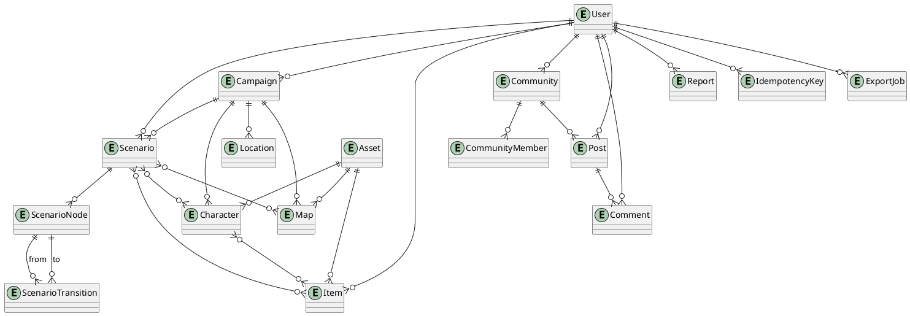

# Переработанная концепция и план доработки платформы «Кузница историй»

## Исходный диагноз проекта

Тема ВКР жизнеспособна и хорошо подходит для специальности 09.02.07, потому что у проекта уже есть не только идея, но и работающая клиент-серверная база: фронтенд на Next.js 14.2.5, React 18.2, TypeScript и Tailwind, backend на Laravel 12 с Sanctum и серверным PDF-экспортом через Browsershot, а также контейнеризация через Docker Compose с отдельными сервисами web, api, postgres и mailpit. В репозитории уже реализованы маршруты для авторизации, профиля, кампаний, сценариев, глав, блоков, карт, персонажей, предметов, жалоб, системных объявлений, экспорта PDF и административного раздела. Это означает, что проект уже перешел из стадии «концепта» в стадию «информационной системы с доменной моделью и API», а значит его можно защищать не как абстрактную идею, а как инженерный продукт. citeturn8file0turn11file0turn14file0turn13file0turn55file0

Ключевая сильная сторона текущей версии — уже существующая осмысленная предметная область. В коде есть сущности кампании, сценария, главы, блока, карты, персонажа, предмета, пользователя, жалобы и административного лога; у кампаний уже есть роль верхнего контейнера для сценариев, карт и персонажей через `campaign_id`, а сценарии уже могут включать главы и блоки. Для ВКР это очень хороший старт: можно показать полноценную доменную декомпозицию, CRUD-потоки, разграничение доступа и тестовое покрытие критичных сценариев. citeturn39file0turn41file0turn42file0turn43file0turn44file0turn45file0turn47file0turn70file0turn55file0

Главная проблема не в том, что проект «слабый», а в том, что он пока концептуально неоднороден. По доступным материалам видно, что новый ТЗ уже двигается в сторону кампаний, социальных функций, комментариев, приватности, очередей и файлового хранилища, тогда как репозиторий все еще реализует в основном линейную модель сценария «сценарий → глава → блоки по порядку», а социальные разделы на фронтенде представлены демонстрационными экранами с хардкодными массивами данных без API-поддержки на сервере. Иными словами, концепция в документах уже шире, чем практическая реализация. Для защиты это не катастрофа, но это главный источник вопросов со стороны руководителя и комиссии. citeturn23file0turn24file0turn29file0turn31file0turn18file0turn19file0turn20file0turn13file0

Самое важное архитектурное расхождение касается редактора сценариев. Сейчас блок хранит только тип, содержимое, порядок и, опционально, сложность проверки; это подходит для линейной текстовой сборки, но не покрывает ветвления, условия переходов, исходы проверок, привязку лута к предмету, открытие локаций и графовую логику прохождения. Пока это редактор последовательных заметок, а не полноценный конструктор интерактивной RPG-структуры. Именно эту часть нужно переработать в первую очередь, потому что она определяет уникальность темы и отвечает на замечания руководителя. citeturn31file0turn23file0turn24file0

Еще одно расхождение — изображения и токены. В текущем коде есть поддержка загрузки только аватара и баннера пользователя; для общих изображений сценариев, карт, предметов, персонажей и токенов отдельного модуля хранения, библиотеки и прав доступа пока нет. Следовательно, тема «библиотека токенов» в текущем проекте фактически еще не реализована и должна быть спроектирована как отдельный модуль, а не как маленькое расширение профиля. citeturn49file0turn50file0turn75file0

Экспорт тоже находится в промежуточном состоянии. На backend уже есть серверный экспорт сценария в PDF, сервис генерации PDF и HTML-шаблон для печати сценария с главами, блоками и связанными картами, но нет отдельного экспорта карт, карточек персонажей, карточек предметов, кампании целиком и, главное, нет полиграфически выверенного двустороннего карточного формата 3×3 на листе A4. То есть базовая технологическая линия для экспорта уже выбрана правильно, но ее нужно развить в сторону требований ВКР, а не переписывать с нуля. citeturn52file0turn54file0turn68file0

Итоговый диагноз такой: проект уже годен как основа ВКР, но сейчас он защищается лучше как «органайзер материалов RPG», чем как «онлайн конструктор сценариев». Чтобы вернуть акцент на тему диплома, нужно сделать центром системы не страницу списка блоков, а модель сценария как управляемого графа, в который подключаются локации, проверки, лут, карты, карточки, комментарии и публикация в сообществах. Это реалистичная переработка: она не ломает существующий стек, не требует полной переписки backend и при этом делает тему намного сильнее на защите. citeturn23file0turn13file0turn55file0

## Целевая концепция и редактор сценариев

Предлагаемая итоговая концепция должна звучать так: «Кузница историй» — это специализированная веб-платформа для мастеров и авторов настольных RPG, предназначенная для проектирования кампаний и сценариев, взаимосвязанного хранения игровых сущностей, подготовки печатных и цифровых материалов для сессии, а также ограниченного совместного обсуждения и публикации контента в сообществах. В этой формулировке одновременно присутствуют предметная область, практическая ценность, инженерная глубина и реалистичный объем реализации.

Высшим агрегирующим контейнером лучше считать **кампанию**, но с важной оговоркой: **сценарий может существовать и автономно**. Это наиболее рациональная схема и для ВКР, и для дальнейшего развития. Кампания объединяет общую вселенную, повторно используемые сущности, несколько приключений, карты и контекст длительной игры. Сценарий представляет собой отдельное приключение, серию сцен или сессию; он может быть привязан к кампании через `campaign_id`, но не обязан ей принадлежать. Такой подход уже частично совпадает и с текущим ТЗ, и с текущей реализацией репозитория, где `campaign_id` у сценария, карты и персонажа является опциональным. citeturn41file0turn42file0turn43file0turn44file0turn45file0turn65file0

Итоговая иерархия сущностей должна быть следующей:

| Уровень | Сущность | Назначение |
|---|---|---|
| Пользовательский | Пользователь | Автор, соавтор, участник сообщества, модератор, администратор |
| Проектный | Кампания | Верхний контейнер общей истории, мира и общих ресурсов |
| Сценарный | Сценарий | Отдельное приключение, сессия или сюжетная ветка |
| Графовый | Узел сценария | Блок/сцена в графе прохождения |
| Связанный контент | Карта, персонаж, предмет, локация, фракция, событие | Реестровые сущности, используемые сценарием и кампанией |
| Визуальный | Токен, изображение, карточка | Представление сущности и печатные материалы |
| Социальный | Сообщество, публикация, комментарий, диалог | Ограниченное взаимодействие пользователей |

Главное концептуальное изменение — отказаться от понимания сценария как «списка блоков» и перейти к пониманию сценария как **графа узлов**. Для интерфейса это самый убедительный и профессиональный путь, а для пользователя — наиболее понятный: сценарий состоит из узлов, узлы соединяются переходами, переходы могут иметь условия. По сути, вам нужен не только текстовый редактор, а упрощенный narrative-graph editor. Это соответствует сильным паттернам у entity["company","Obsidian","knowledge app"] Canvas и whiteboard/board-подходам у entity["company","LegendKeeper","worldbuilding platform"], но в «Кузнице историй» этот граф должен быть не абстрактным, а доменно-ориентированным под RPG. citeturn3search0turn3search3turn2search0turn2search1turn2search3

Минимально необходимая модель узлов для ВКР должна включать шесть типов: **Описание**, **Диалог**, **Место**, **Чек**, **Лут**, **Бой**. Важно сохранить два уже реализованных типа — описание и бой, потому что они есть в текущем редакторе и полезны для демонстрации. Но фокус ответа на замечания руководителя нужно сделать на четырех типах ниже.

**Диалог** — это узел, представляющий разговор, реплику NPC, монолог, развилку общения или выдачу квеста. Он должен хранить заголовок, текст сцены, спикера или список участников, заметки ведущего, список вариантов ответа игроков и, при необходимости, флаг «скрыть игрокам до активации». Диалог должен уметь порождать разные переходы по выбору пользователя: «спросить о квесте», «напасть», «уйти», «показать предмет». Такие переходы — это не части текста, а отдельные ребра графа. 

**Место** — это узел посещения локации. Он должен связываться с сущностью «локация» и, при наличии, с картой или фрагментом карты. В нем хранятся название, описание окружения, список доступных интеракций, состояние открытия, заметки ведущего и возможные входные/выходные переходы. Такой узел нужен, чтобы не смешивать «что происходит» и «где это происходит» в одном абзаце текста.

**Чек** — это узел проверки. Он должен хранить тип проверки, значение сложности, опциональный модификатор, текст условия, режим успеха/провала и ссылки на узлы, в которые переводит исход проверки. Этот узел нельзя хранить просто как число difficulty в общем блоке, потому что у проверки есть семантика: проверяемый параметр, последствия, требования, подсказки, награда или штраф.

**Лут** — это узел выдачи награды. Он должен хранить источник награды, связанный предмет или набор предметов, количество, шанс, способ получения и условие активации. На практике это означает, что лут должен связываться с предметом из реестра и с событием-источником: победа над монстром, успешный чек, открытие контейнера, завершение ветки диалога, выполнение условия. Именно такой узел делает систему не просто редактором текста, а редактором игровых последствий.

Оптимальная модель переходов между узлами выглядит так:

| Тип перехода | Когда используется |
|---|---|
| `linear` | обычный последовательный переход |
| `choice` | выбор игрока в диалоге или развилке |
| `success` | успешная проверка |
| `failure` | провал проверки |
| `condition` | переход по флагу, переменной, статусу, наличию предмета |
| `combat_end` | завершение боя |
| `loot_claimed` | награда получена |
| `location_unlocked` | открыта новая локация |
| `manual` | переход по решению ведущего |

Для ВКР сценарии должны быть **ветвящимися, но умеренно**. Не нужно строить сложный движок прохождения с полноценным runtime, журналом партии и синхронизацией состояния игроков. Достаточно, чтобы автор мог визуально задать ветвления, а ведущий — увидеть логику сценария и экспортировать ее в понятный вид. То есть цель — **редактор структуры сценария**, а не полноценный игровой движок. Это важная граница объема.

Практически это значит, что интерфейс редактора лучше сделать двухрежимным. Первый режим — **структурный**, в виде canvas/графа с узлами и связями. Второй — **редакционный**, где выбранный узел открывается в правой панели свойств для заполнения текста, связей, условий и привязок к сущностям. Текущую идею бокового списка разделов и правой панели параметров можно сохранить, но центральная часть должна стать не длинной лентой блоков, а рабочим полем узлов. Это повысит соответствие теме «конструктор сценариев» и одновременно сделает интерфейс ближе к ожиданиям пользователя. citeturn23file0turn16file0turn3search0turn2search0

Конкурентный ориентир здесь лучше брать выборочно. У entity["company","World Anvil","worldbuilding platform"] стоит заимствовать интерлинковку сущностей, шаблоны и приватные материалы мастера, но не громоздкую энциклопедическую модель. У entity["company","Kanka","worldbuilding platform"] полезны роль-ориентированные права, упоминания и связи между объектами, но их permission-модель не стоит полностью копировать в ВКР. У entity["company","Roll20","virtual tabletop platform"] полезно понимание handout/character/token и разделение «видно игрокам» / «только для ГМа», но не нужно превращать проект в VTT. У entity["company","Campfire","writing platform"] стоит взять модульность, карты и совместное использование с разными режимами видимости, но не пытаться воспроизвести весь писательский комбайн. citeturn0search0turn0search2turn0search3turn1search1turn1search5turn0search1turn4search4turn4search6turn4search9

## Обновленная функциональная модель

Функциональную модель лучше строить модулями, но сразу разделять их на три слоя: **обязательно для защиты**, **желательно для усиления работы**, **перспективы развития**. Именно это позволит не перегрузить ВКР.

**Обязательно для защиты** должны войти: авторизация и профиль, кампании, сценарии, графовый редактор узлов сценария, карты, персонажи, предметы, связи между сущностями, библиотека пользовательских изображений и токенов, базовый экспорт в PDF, комментарии к материалам, публикация в сообщество, базовая модерация публикаций и идемпотентная обработка критичных POST-запросов. Такой набор уже выглядит как полноценная информационная система, а не как набор отдельных CRUD-экранов.

**Желательно реализовать**, если останется время: двусторонний экспорт карточек персонажей и предметов, отдельный экспорт карты в PNG/PDF, сохранение объектов как шаблонов, приглашения в кампанию по ссылке, история изменений сущности, простые личные диалоги без realtime.

**Перспективы развития**: realtime-чаты и presence, одновременное совместное редактирование графа, live-map synchronization, расширенный граф связей кампании, рекомендации контента, продвинутая система достижений/рейтинга авторов, полноценные мобильные клиенты. Такой объём не надо обещать к защите, но надо корректно заложить в архитектуру. citeturn13file0turn23file0turn70file0

Практически полезно зафиксировать следующий модульный минимум.

| Модуль | Что входит в минимум ВКР | Что можно вынести после защиты |
|---|---|---|
| Авторизация и пользователи | регистрация, вход, профиль, роли, аватар | OAuth, расширенные настройки присутствия |
| Кампании | CRUD, привязка сценариев и сущностей, приватность | архивирование версий, статистика кампании |
| Сценарии | CRUD, статус, теги, публикация | дубликаты, fork-сценарии |
| Редактор сценариев | canvas узлов, переходы, правая панель свойств | совместное редактирование в реальном времени |
| Узлы сценария | Диалог, Место, Чек, Лут, Описание, Бой | триггеры, переменные, runtime-simulation |
| Карты | grid, объекты, токены, сохранение | синхронизация с боевой сценой |
| Персонажи | карточка, параметры, токен, связи | инвентарь как отдельные слоты/эквип |
| Предметы | реестр, редкость, свойства, токен | крафт, рецепты, потребление |
| Токены и изображения | загрузка, библиотека, привязка к сущности | AI-обработка, пакетный импорт |
| Экспорт | сценарий PDF, карты PNG/PDF, карточки PDF | JSON/ZIP-бандлы, Markdown |
| Сообщества | создание сообщества, посты-публикации, лента | рейтинги, подписки, коллекции |
| Обсуждения | комментарии к публикациям и материалам | вложенные треды, реакция-эмодзи |
| Модерация | жалобы, скрытие публикации, журнал действий | автоматическая модерация |
| Идемпотентность | ключи для создания/публикации/экспорта | распределённая реализация через Redis |
| Администрирование | обзор, пользователи, жалобы, объявления | dashboard-аналитика |

Функциональные требования к социальному блоку нужно упростить и сделать реалистичными. Вместо форума рекомендую модель **сообщества как тематического пространства публикаций**. Сообщество — это контейнер, внутри которого участники публикуют сценарии, карты, карточки и шаблоны, а обсуждение идет в комментариях под публикацией, а не в отдельном древовидном форуме. Это выглядит современно, реализуется проще, а пользователю понятнее. Внутри сообщества достаточно ролей: владелец, администратор, модератор, участник. Вступление — по открытой заявке или приглашению. Для защиты ВКР этого более чем достаточно. Усложненный форум, разделы/подразделы и полноценные треды стоит убрать из обязательного объема. Такая модель лучше согласуется и с роль-ориентированным доступом в духе entity["company","Kanka","worldbuilding platform"], и с уже существующей в репозитории подсистемой жалоб/админ-логов. citeturn0search3turn1search5turn70file0turn13file0

Нефункциональные требования стоит ужесточить и сделать инженерно «защищаемыми». В текущем проекте уже есть Sanctum, checks ownership, тесты на границы владения, роли пользователя, статус пользователя и модерационные таблицы, поэтому в новом ТЗ нужно прямо записать: серверная проверка доступа ко всем ресурсам; хранение авторизации в защищенной cookie-схеме SPA; валидация входных данных через FormRequest; журналирование административных действий; серверная генерация PDF; раздельное хранение пользовательских файлов; возможность фонового выполнения тяжелых задач; трассировка критичных запросов и идемпотентность операций создания и экспорта. Это не абстрактные пожелания — такая линия уже соответствует текущему стеку и легко защищается на комиссии. citeturn11file0turn13file0turn50file0turn55file0turn70file0turn75file0

## Архитектура, данные, изображения, экспорт и идемпотентность

Подходящая архитектура для «Кузницы историй» — **модульный монолит**. Это важный выбор: не микросервисы, потому что для ВКР это неоправданно сложно; не «монолит без границ», потому что проект уже вырос из одной папки с контроллерами. У вас уже есть хорошие зачатки модульности на backend в виде доменных каталогов `Auth`, `Core`, `Export`, `Admin`, а на фронтенде — отдельные view-компоненты и мапперы. Значит, правильное решение — продолжить в том же направлении: один Laravel API, одна БД PostgreSQL, один фронтенд Next.js, отдельные домены и сервисы внутри backend и более мелкие feature-модули на фронтенде. citeturn11file0turn13file0turn54file0turn16file0

Для ВКР **не советую срочно мигрировать** фронтенд на Next.js 16 и React 19, а backend — на Laravel 13. Официальная документация подтверждает, что Next.js 16 уже вышел и содержит заметные breaking changes, включая смену привычек сборки и удаление `next lint`, а React 19 требует отдельного апгрейд-пути и совместимости, начиная хотя бы с React 18.3. Laravel 12 уже считается «старой» веткой документации, но это не означает, что проект надо обязательно обновлять перед защитой. Практически правильнее сейчас стабилизировать доменную модель, редактор сценариев, изображения и экспорт, а миграции версий вынести в post-defense phase. Исключение — если вы все равно будете радикально перестраивать фронтенд под App Router и серверные экшены; тогда обновление может быть оправдано, но это уже отдельный проект. citeturn7search3turn7search5turn7search2turn8search1turn8search3turn5search1

Оптимальная структура данных для переработанной версии выглядит так:

| Таблица | Ключевые поля | Основные связи |
|---|---|---|
| `users` | id, name, email, role, status, avatar_url, banner_url, bio | 1:M с кампаниями, сценариями, публикациями |
| `campaigns` | id, user_id, title, description, visibility | 1:M со сценариями, картами, сущностями |
| `scenarios` | id, user_id, campaign_id, title, description, visibility, status | 1:M с узлами и переходами |
| `scenario_nodes` | id, scenario_id, chapter_id?, node_type, title, body, x, y, config_jsonb | M:1 к сценарию; привязки к сущностям |
| `scenario_transitions` | id, scenario_id, from_node_id, to_node_id, transition_type, label, condition_jsonb | ребра графа |
| `locations` | id, campaign_id, name, type, description, map_id?, image_asset_id? | M:M со сценариями |
| `characters` | id, campaign_id?, scenario_id?, name, role, race, stats_jsonb, token_asset_id? | M:M со сценариями и картами |
| `items` | id, user_id, campaign_id?, name, rarity, description, token_asset_id? | M:M со сценариями, персонажами |
| `maps` | id, user_id, campaign_id?, scenario_id?, name, width, height, data_jsonb, image_asset_id? | M:M с локациями и сценами |
| `assets` | id, owner_type, owner_id, kind, mime_type, storage_path, checksum, is_system | библиотека файлов |
| `entity_links` | id, source_type, source_id, target_type, target_id, link_type | универсальные связи |
| `communities` | id, owner_id, name, slug, description, visibility | 1:M с публикациями и участниками |
| `community_members` | community_id, user_id, role, status | роли внутри сообщества |
| `posts` | id, community_id, author_id, resource_type, resource_id, text, status | публикации материалов |
| `comments` | id, author_id, target_type, target_id, body, status | обсуждения |
| `reports` | id, reporter_id, target_type, target_id, reason, status | жалобы |
| `idempotency_keys` | id, user_id, key, method, route, request_hash, response_hash, status_code, expires_at | защита от дублей |
| `export_jobs` | id, user_id, export_type, target_type, target_id, params_jsonb, status, file_asset_id | фоновые экспорты |

Здесь принципиально важно оставить **JSONB только там, где он оправдан**: конфигурация узла, map-canvas data, набор статов, параметры экспорта, произвольные метаданные. Но все поля, которые участвуют в правах доступа, фильтрации, внешних ключах и публикации, должны быть нормализованы. Это согласуется и с новой редакцией ТЗ, и с тем, как уже используются JSONB в репозитории для карт, характеристик и модификаторов, не превращаясь в свалку всего подряд. citeturn33file0turn35file0turn37file0turn45file0turn47file0

Для приложений с графовым сценарием полезно зафиксировать UML/ER-ядро уже в ТЗ. Ниже — компактный вариант на PlantUML, который можно почти без изменений перенести в пояснительную записку:

Модуль изображений и токенов нужно проектировать как отдельное файловое ядро, а не как «поле image_url». Рекомендую такую политику. Для пользовательской загрузки поддерживать **PNG, JPEG, WebP**; SVG не принимать от обычных пользователей, а использовать только для системной библиотеки, потому что SVG несет дополнительные риски скриптов и встраиваемого контента. Ограничение размера для пользовательских токенов — до 5 МБ, для полноразмерных карт — до 15–20 МБ, с обязательной валидацией расширения, MIME, сигнатуры файла, переименованием в серверный UUID, хранением вне webroot и раздачей через контролируемый endpoint. Это полностью соответствует рекомендациям entity["organization","OWASP","application security foundation"] по безопасной загрузке файлов. citeturn11search0turn11search1

Разделение библиотеки должно быть двухуровневым: **system assets** и **user assets**. System assets — встроенные токены и иконки, поставляемые вместе с приложением и доступные всем. User assets — загруженные пользователем изображения, доступ к которым определяется владельцем, кампанией, публикацией или сообществом. Тогда токен можно привязать к персонажу, предмету, карте, локации, сцене, луту или публикации через `asset_id`, не дублируя файлы.

Экспорт материалов рекомендую разделить строго по целям использования. **PDF** — для сценариев и печатных карточек. **PNG/JPEG** — для карт и отдельных визуальных материалов. **JSON** — для резервного копирования и обмена структурой сценария. **ZIP** — для экспорта кампании целиком, если в будущем понадобится выгрузка сценария, карт, карточек и связанных JSON-манифестов в одном архиве. Это лучше, чем пытаться одним форматом решить все задачи. Текущий стек уже использует серверную HTML→PDF генерацию через Browsershot, поэтому именно эту линию и нужно закрепить в ТЗ как базовую. citeturn11file0turn52file0turn54file0turn68file0

Карточки персонажей и предметов для печати нужно реализовать как **отдельный экспортный шаблон**, а не как видоизмененный сценарий. Логика должна быть такой: один лист A4 содержит 9 карточек в сетке 3×3; экспорт генерирует как минимум две страницы на один набор из 9 карточек — лицевую и оборотную; на обороте карточки располагаются в **зеркальном порядке по колонкам**, чтобы при двусторонней печати и резке передняя и задняя стороны совпадали без ручного совмещения. В настройках экспорта нужно дать пользователю пресет «переворот по длинной стороне» по умолчанию и опционально «по короткой стороне» для принтеров с другой логикой. Это решает ту самую проблему, на которую обратил внимание руководитель.

Лицевая сторона карточки персонажа должна содержать: имя, роль, уровень/сложность, краткое описание, ключевые параметры, токен/портрет и визуальный маркер редкости или фракции. Оборот — расширенное описание, способности, связи, заметки для ведущего или игрока, QR/ID карточки. Для предмета лицевая сторона — название, тип, редкость, иконка, краткий эффект; оборот — полное описание, свойства, ограничения, стоимость, вес, условия выдачи. Такой формат и печатается, и показывается на защите значительно убедительнее, чем просто список предметов в таблице.

Идемпотентность в этом проекте нужна не «для красоты», а потому что многие пользовательские действия по своей природе подвержены случайным повторам: двойной клик по кнопке создания сценария, повторный запрос при нестабильной сети, повторная генерация PDF, повторная публикация в сообщество, повторная загрузка изображения. По определению entity["organization","IETF","internet standards body"], `Idempotency-Key` нужен как раз для того, чтобы сделать неидемпотентные методы, такие как POST и PATCH, более устойчивыми к повторам; практика entity["company","Stripe","payments company"] показывает рабочую реализацию: ключ клиентом, сохранение результата первого запроса, возврат того же результата при повторе, сравнение входных параметров и истечение ключа по TTL. citeturn9search0turn9search3turn10search0

Для «Кузницы историй» рекомендую такую реализацию. Клиент посылает заголовок `Idempotency-Key` для всех критичных `POST` и части `PATCH`: создание кампании, сценария, узла, перехода, комментария, публикации, экспортного задания, загрузки изображения. Сервер вычисляет `request_hash`, сохраняет пару `(user_id, route, key)` и, если видит повтор с тем же хешем, возвращает уже созданный ответ. Если ключ совпадает, а хеш тела отличается, сервер отвечает `409 Conflict`. TTL ключа — 24 часа для пользовательских POST, 1–6 часов для export jobs; для невалидационных ошибок запись можно не коммитить, чтобы повтор был допустим. Это даст очень заметный инженерный плюс проекту на защите и одновременно реально защитит от дублей. citeturn9search0turn10search0

## Практический план доработки и приоритеты ВКР

Самый реалистичный путь доработки — не переписывать всю систему, а пройти десять последовательных этапов, каждый из которых завершает конкретный риск и добавляет демонстрируемую ценность.

| Этап | Цель | Что сделать | Какие части затрагиваются | Обязательность |
|---|---|---|---|---|
| Уточнение структуры кампаний, сценариев и блоков | устранить понятийную неоднозначность | утвердить модель `campaign -> scenario -> nodes -> transitions`, описать типы узлов и переходов | ТЗ, пояснительная записка, migrations, types | обязательно |
| Переработка редактора сценариев | сделать проект действительно «конструктором» | заменить линейный поток блоков на canvas узлов и связей; сохранить правую панель свойств | `ScenarioEditor.tsx`, API узлов и переходов | обязательно |
| Библиотека токенов и загрузка изображений | закрыть требование по токенам | ввести `assets`, выбор токена, привязку к сущностям, системную и пользовательскую библиотеку | backend files/assets, frontend selectors | обязательно |
| Карточки персонажей и предметов | подготовить печатные материалы | сущности карточек, шаблоны оформления, экспортные макеты | characters/items UI, export templates | желательно, но очень усиливает ВКР |
| Экспорт карт, сценариев и карточек | завершить производственный контур | PDF сценария, PNG/PDF карты, PDF карточек, экспорт кампании как ZIP/JSON | export service, queue jobs, templates | обязательно для сценария; остальное желательно |
| Перевод форума в сообщества | упростить социальный блок | community, posts, comments, membership, moderate | новые таблицы и API, frontend community | желательно, но достаточно базовой версии |
| Идемпотентность | защититься от дублей | middleware/service для `Idempotency-Key`, таблица ключей, повтор результата | middleware, DB, critical controllers | обязательно |
| Улучшение интерфейса | привести UX к теме проекта | упорядочить навигацию, добавить библиотеку токенов, экран экспорта, страницу сообщества, страницу карточки | frontend components | обязательно |
| Тестирование | подтвердить качество | unit/feature tests для graph editor API, ownership, assets, export, idempotency | backend tests, e2e smoke | обязательно |
| Подготовка материалов ВКР | синхронизировать документы и код | обновить ТЗ, README, диаграммы, разделы записки, скриншоты | документация | обязательно |

В текущем репозитории особенно сильно стоит переработать три участка. Первый — `web/src/components/ScenarioEditor.tsx`: сейчас это большой монолитный файл, совмещающий список сценариев, главы, линейные блоки, композер и правую панель свойств. Его нужно разделить хотя бы на `ScenarioCanvas`, `NodeInspector`, `ScenarioLibrary`, `TransitionEditor`, `ScenarioToolbar`. Второй — схема БД `chapters/blocks`: её нужно расширить таблицами переходов и специализированной конфигурацией узлов. Третий — социальные view-компоненты: `CommunityView`, `FriendsView`, `MessagesView` сейчас визуально существуют, но не подкреплены API на сервере. citeturn23file0turn18file0turn19file0turn20file0turn13file0

MVP для защиты я рекомендую зафиксировать так:

1. Регистрация, вход, профиль.  
2. Кампании как верхний контейнер.  
3. Сценарии как отдельные приключения.  
4. Графовый редактор узлов с типами: Описание, Диалог, Место, Чек, Лут, Бой.  
5. Карты с токенами и привязкой к сценам/локациям.  
6. Реестр персонажей и предметов с привязкой токенов.  
7. Публикация сценария или шаблона в сообщество.  
8. Комментарии к публикации.  
9. Серверный экспорт сценария в PDF.  
10. Идемпотентность критичных POST-операций.

Это уже полноценная система, которую можно защитить как прикладной веб-продукт: есть пользователи, роли, предметная модель, графовый редактор, база данных, печатный контур, безопасность, тестирование и социальный модуль.

Вынести после защиты стоит то, что резко увеличивает трудоемкость, но не является обязательным для доказательства инженерной состоятельности: realtime-чаты через WebSocket, presence-статусы, одновременное редактирование, push-уведомления, синхронный боевой режим карты, рекомендации контента и сложная аналитика. Официальная документация Laravel действительно позволяет использовать Reverb и broadcasting, но подключать это в дипломный проект имеет смысл только если базовая доменная модель уже стабилизирована. Иначе WebSocket-слой съест время, не дав главного улучшения темы — качественного редактора сценариев. citeturn5search0turn6search0

С точки зрения интерфейса приоритеты такие. На главной панели нужен быстрый path: «создать кампанию», «создать сценарий», «открыть последний сценарий», «экспортировать». В редакторе сценария нужны canvas, миникарта, палитра типов узлов, явный режим связей и фильтр по сущностям. В библиотеке токенов — разделение на системные и личные, поиск по типу и предпросмотр. В экспорте — отдельный экран с выбором формата и опций печати. В сообществах — не форумоподобная витрина, а лента публикаций с карточками материалов и комментариями. На приложенных экранах уже есть сильный фирменный стиль и хороший «киберпанк/редакторский» визуальный язык, поэтому сейчас важнее не менять стиль, а довести информационную архитектуру и убрать ощущение демонстрационных макетов. citeturn16file0turn23file0turn18file0turn19file0turn20file0

## Готовые формулировки для пояснительной записки и итоговые рекомендации

**Актуальность темы.**  
Актуальность разработки обусловлена ростом интереса к настольным ролевым играм и необходимостью цифрового инструмента, который позволяет мастеру системно подготавливать сценарии, карты, персонажей, предметы и печатные материалы в единой среде. На практике подготовка к сессии часто распределена между текстовыми документами, графическими редакторами, таблицами и мессенджерами, что затрудняет сопровождение сценария, повторное использование контента и совместную работу. Репозиторий проекта подтверждает, что такие данные уже естественным образом распадаются на разные сущности и сервисы, а анализ внешних платформ показывает устойчивый спрос на worldbuilding- и campaign-management-инструменты. citeturn13file0turn42file0turn43file0turn44file0turn45file0turn0search0turn1search5turn2search0turn4search9

**Цель проекта.**  
Целью ВКР является разработка веб-приложения «Кузница историй», предназначенного для создания, структурирования, визуального проектирования и экспорта сценариев настольных RPG, а также для хранения связанных игровых сущностей и ограниченного совместного взаимодействия пользователей в сообществах.

**Задачи проекта.**  
К основным задачам относятся: анализ предметной области; формирование доменной модели кампаний, сценариев и узлов сценария; проектирование клиент-серверной архитектуры; разработка базы данных; реализация редактора сценариев; внедрение модулей карт, персонажей, предметов и токенов; обеспечение экспорта материалов; реализация прав доступа, безопасности и идемпотентности; тестирование и подготовка проектной документации.

**Объект исследования.**  
Объектом исследования являются процессы цифровой подготовки и сопровождения сценариев настольных ролевых игр.

**Предмет исследования.**  
Предметом исследования являются методы проектирования веб-приложения для структурированного хранения и редактирования сценарных, картографических и справочных материалов RPG-кампаний.

**Практическая значимость.**  
Практическая значимость проекта состоит в создании прикладного инструмента, который сокращает время подготовки игровой сессии, снижает риск потери и рассогласования данных, делает повторное использование контента удобным и позволяет формировать готовые цифровые и печатные материалы для проведения игры.

**Назначение системы.**  
Система предназначена для мастеров, авторов и соавторов настольных RPG и обеспечивает централизованную работу со сценариями, картами, персонажами, предметами, токенами, комментариями и публикациями в сообществах.

**Основные пользователи.**  
Основными пользователями являются автор сценария, ведущий кампании, соавтор, участник сообщества, модератор сообщества и системный администратор. В текущем проекте роль-ориентированная модель уже поддерживается на уровне пользователя, а административные функции и модерационные таблицы уже присутствуют в backend. citeturn75file0turn70file0turn13file0

**Описание архитектуры.**  
Система реализуется по клиент-серверной архитектуре в виде модульного монолита. Клиентская часть построена на Next.js и TypeScript, серверная часть — на Laravel, БД — PostgreSQL, обмен данными осуществляется через REST API, длительные задачи выносятся в фоновые процессы, а контейнеризация обеспечивается Docker Compose. Такой стек уже используется в проекте и обеспечивает воспроизводимость развертывания и достаточный запас для развития. citeturn8file0turn11file0turn14file0

**Описание базы данных.**  
База данных строится вокруг сущностей пользователя, кампании, сценария, узла сценария, перехода сценария, карты, персонажа, предмета, токена/ресурса, сообщества, публикации, комментария и журнала идемпотентных запросов. Нормализованные таблицы используются для ключевых связей, а JSONB применяется только для вариативных структур, например конфигурации узлов, данных карты и параметров экспорта.

**Описание мер безопасности.**  
Безопасность системы обеспечивается аутентификацией через защищенную cookie-based SPA-схему с Sanctum, серверной валидацией входных данных, проверкой прав доступа к ресурсам, разграничением приватности, безопасной политикой загрузки файлов, журналированием административных действий и покрытием критичных сценариев тестами. Репозиторий уже содержит маршруты Sanctum, проверки владения ресурсами и feature-тесты на forbidden/404 границы, а рекомендации по файлам должны быть дополнены практиками OWASP. citeturn11file0turn13file0turn50file0turn55file0turn11search0turn11search1

**Описание идемпотентной обработки запросов.**  
Идемпотентная обработка запросов применяется для защиты от дублирования данных при повторной отправке POST/PATCH-запросов. Для этого клиент передает `Idempotency-Key`, сервер сохраняет ключ, хеш тела запроса и результат первой успешной обработки, а при повторе с теми же параметрами возвращает ранее созданный ответ. При совпадении ключа и различии тела запроса возникает конфликт. Такой подход соответствует современным рекомендациям HTTP API и практической модели, используемой в индустрии. citeturn9search0turn10search0

**Описание экспорта печатных материалов.**  
Система должна поддерживать серверный экспорт сценариев в PDF и отдельный печатный экспорт карточек персонажей и предметов. Для карточек используется макет 3×3 на листе A4, при котором лицевая и оборотная стороны формируются в согласованной сетке и автоматически зеркалируются для корректной двусторонней печати. В репозитории уже существует рабочая основа серверного PDF-экспорта сценариев через HTML-шаблон и Browsershot, что позволяет развить этот контур без смены технологии. citeturn11file0turn52file0turn54file0turn68file0

**Итоговые рекомендации.**  
В первую очередь нужно переработать доменную модель сценария и редактор блоков. Это самое важное решение, которое избавит проект от главного концептуального дефекта. Во вторую очередь нужно выделить модуль токенов и изображений, потому что без него сложно обосновать карты, карточки и визуальные сущности. В третью очередь нужно развить экспорт до отдельного контра с карточками и картами. Социальные функции следует сузить до модели «сообщество + публикации + комментарии + модерация», не пытаясь реализовать полноценный форум и realtime-мессенджер к защите. Из технологических решений сразу стоит принять три: оставить текущий стек до защиты, зафиксировать кампанию как верхний контейнер с опционально автономным сценарием и внедрить идемпотентность для всех критичных операций создания. Это минимизирует риск поздней переделки и одновременно делает ВКР более инженерной и убедительной. citeturn8file0turn11file0turn13file0turn23file0turn50file0turn54file0turn9search0turn10search0

**Открытые вопросы и ограничения.**  
Некоторые выводы по новому ТЗ и приложенным экранам основаны на прямом анализе предоставленных файлов и визуальных материалов; при этом наиболее надежные технические выводы опираются на код репозитория и официальные внешние источники. До финальной версии ТЗ остается формально уточнить два решения: сохраняются ли «главы» как самостоятельная сущность поверх графа узлов и будет ли сценарий допускать автономное существование вне кампании на уровне пользовательского интерфейса, а не только на уровне БД. Эти вопросы не мешают текущей переработке, но их лучше зафиксировать до начала рефакторинга редактора.